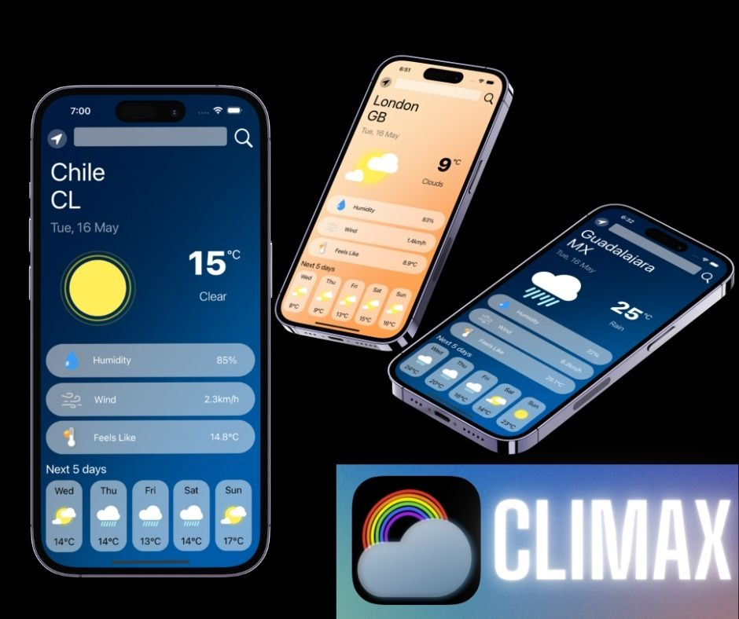

## Table of contents
* [General info](#general-info)
* [Technologies](#technologies)
* [Framworks](#frameworks)
* [Features](#features)
* [Screenshots](#screenshots)
* [Acknowledgments](#acknowledgments)

## General info
This project is a weather app that shows the current weather dependin on the location or the place you are looking for. Also shows the current humidity, wind and feels like conditions. At below of the whole screen it shows the tempetarure of the next five days.

## Technologies
> API REST (Fetched from Open Weather)

## Frameworks
> UIKIT
> CoreLocation

## Features 
> Simplicity to read.
> Current Temperature with an image representation.
> Three main conditions related to weather: "Hmidity", "Wind" and "Feels like".
> Forecast of the next five tha includes: "Day" "Image representation" and "Temperature".

## Screenshots

## Acknowledgments
> The design was inspired in Sayid Moghadam "Weather App" design. https://www.figma.com/@moghadam 
> The iconset used where created by Bora Dan "Degry Weather Iconset". https://www.figma.com/@bqra
> The app icon was created by Zvonimir Juranko. https://www.figma.com/@zvosh
